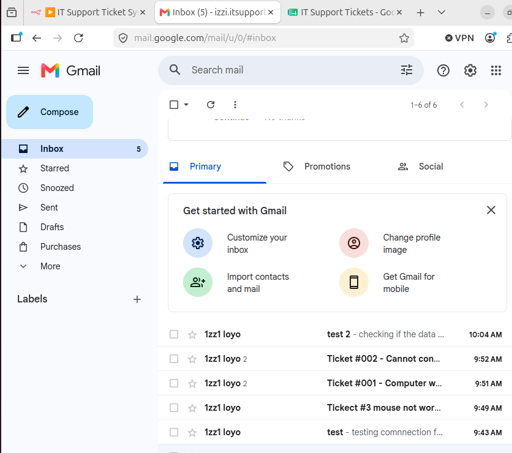

# 🎫 Automated IT Support Ticketing System

A fully automated IT helpdesk system built from scratch on a 
virtualized VMware lab. Zero human intervention required — 
tickets are received, logged, solved by AI, and replied to 
automatically.

## 🏗️ Architecture

Email Received → n8n Automation → Google Sheets Log → 
AI Solution Generated → Auto-Reply Sent to User

## 🛠️ Tech Stack

- **VMware Workstation** — Virtualized lab environment
- **Ubuntu Server** — Automation server
- **Docker** — Container platform
- **n8n** — Automation workflow engine
- **Gmail OAuth2** — Ticket intake and auto-reply
- **OpenAI GPT-4o-mini** — AI-powered IT solutions
- **Google Sheets** — Ticket database and knowledge base

## ✨ Features

- 📧 Automatic email ticket intake
- 🎫 Unique ticket ID generation (TKT-YYYYMMDD-XXXX)
- 📊 Real-time Google Sheets logging
- 🧠 AI-generated step-by-step solutions
- 📬 Automatic reply to users with solution
- 🌍 Multi-language support (English, French, Spanish)
- 💾 Solution saved to knowledge base
- 🚫 Duplicate ticket prevention

## 🔄 Workflow

1. User sends email to helpdesk inbox
2. n8n catches email every minute
3. Ticket logged to Google Sheets with unique ID
4. OpenAI analyzes the issue
5. AI generates friendly step-by-step solution
6. User receives auto-reply with solution in their language
7. Solution saved to Google Sheets knowledge base

## 📸 Screenshots

## 📸 Screenshots

### n8n Workflow

### Gmail Inbox with Tickets

### Google Sheets Ticket Log

### Auto Reply in English

### Auto Reply in Spanish

### Auto Reply in French

### n8n All Nodes Green

## 🧪 Lab Environment

| Component | Details |
|-----------|---------|
| Host OS | Windows 11 |
| VM 1 | Ubuntu Desktop (n8n server) |
| VM 2 | Windows 11 (client) |
| Network | VMware NAT |
| n8n Version | 2.20.9 |

## 📋 How to Replicate

1. Install VMware Workstation
2. Create Ubuntu VM with Docker
3. Run n8n with Docker
4. Configure Gmail OAuth2 credentials
5. Set up Google Sheets
6. Import workflow JSON
7. Configure OpenAI API key
8. Activate workflow

## 🔮 Future Improvements

- [ ] SMS notifications via Twilio
- [ ] Escalation system for critical tickets
- [ ] Dashboard with ticket statistics
- [ ] Slack integration
- [ ] Automatic ticket closure after resolution

## 👨‍💻 Author

Built as part of my IT Support and Cybersecurity home lab 
practice to prepare for my first IT/Security role.
